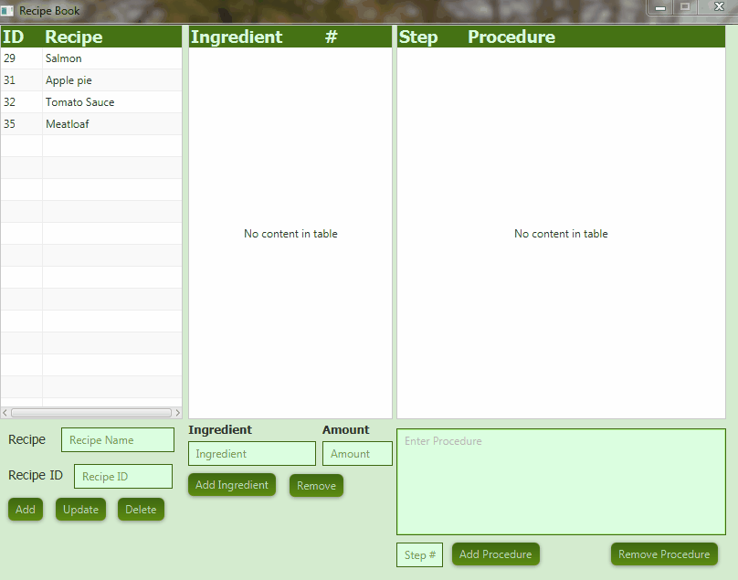

# RecipeBook

RecipeBook is a program for storing recipes in an easy to read format that allows for
easy editing of recipes.

Created by Matthew Moore

## Usage

To create a new recipe the user must enter a recipe name into the Recipe text field and
select the Add button.  
To update a recipe name the user must enter the recipe ID along with the new recipe name
and select the Update button.
To remove a recipe, the user must select the recipe from the Recipe table and select the
Delete button. 

To view the ingredients & procedure for a recipe, the user must double click on a recipe
from the recipe table.  This will populate the Ingredients & Procedure tables allowing
for editing.

To add ingredients to the ingredient table, select a recipe and enter the ingredient name
and amount then select the Add Ingredient button.

To remove an ingredient from the ingredient table, select the ingredient from the table
and select the remove button.

To add a procedure to the procedure table, enter procedure details and step # then select
the Add Procedure button.  Procedures will auto-sort by the step #.

To remove a procedure, select the procedure from the procedure table and press the Remove
Procedure button.

